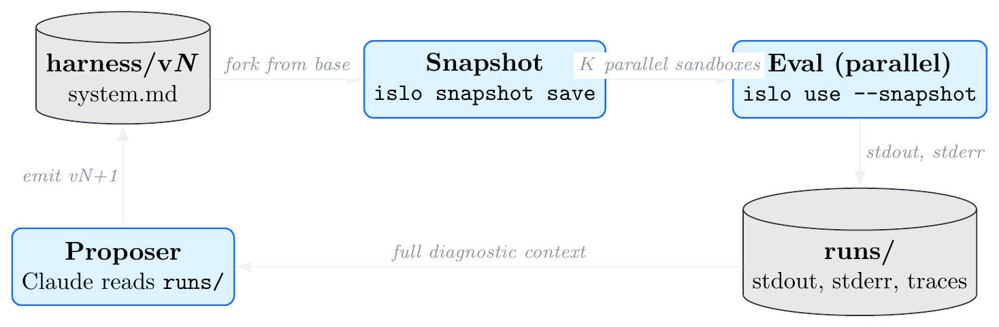
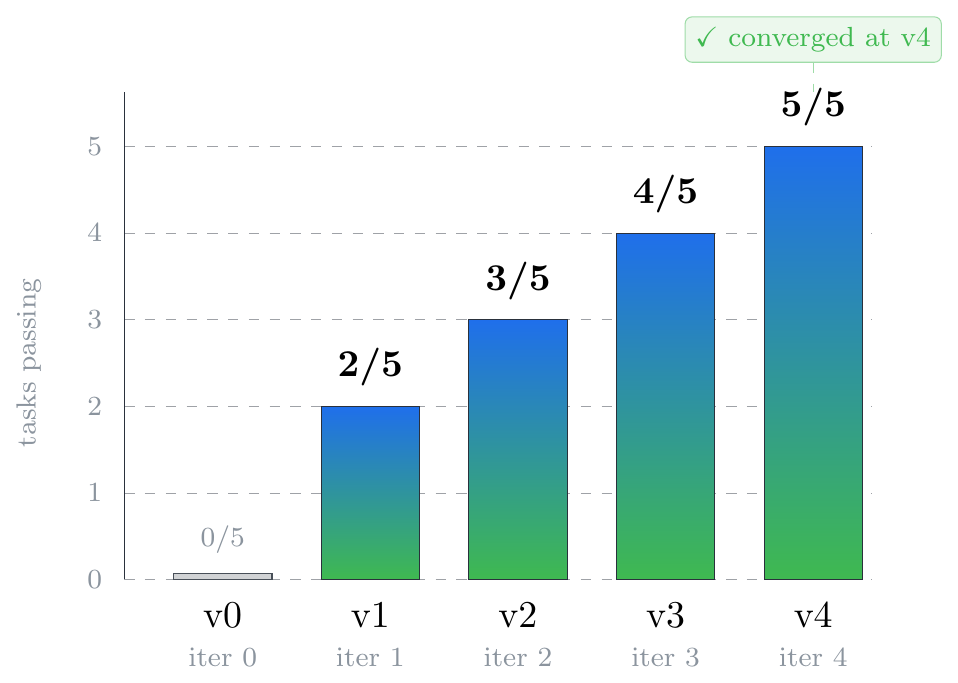
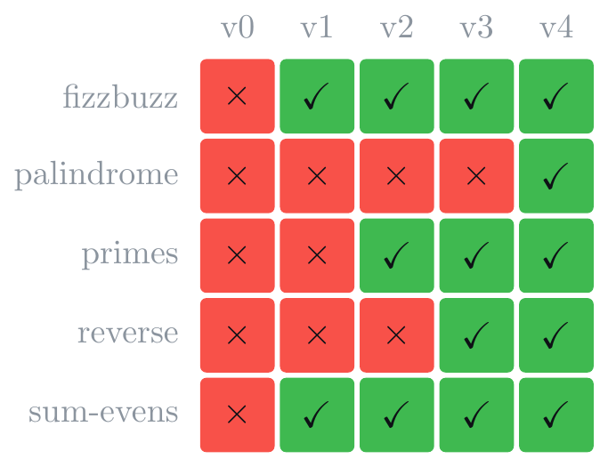

# meta-harness-eng-islo

A ~200-line POC that wires the [meta-harness](https://yoonholee.com/meta-harness/) optimization loop onto Islo sandboxes. Goes from **0/5 to 5/5 in four proposer steps**, end-to-end, in about two seconds.

> **Read the writeup** — [`docs/POST.md`](./docs/POST.md) (Markdown, paste into Substack) or [`docs/post.pdf`](./docs/post.pdf) (typeset, with diagrams and charts).
>
> **Project page** — [zozo123/islo-sandbox-based-meta-harnessing-demo](https://github.com/zozo123/islo-sandbox-based-meta-harnessing-demo) (paper-style website).



---

## Quick start (offline, deterministic)

```bash
bin/meta-harness demo            # run the optimization loop, ~2 seconds
bin/meta-harness viz             # serve the live dashboard
# open http://localhost:8765/viz/
```

You should see the loop progress **0/5 → 2/5 → 3/5 → 4/5 → 5/5** in 4 proposer steps and converge.




## Layout

```
islo.yaml             base sandbox config
tasks/<name>/         prompt.md + grade.sh per task (5 tasks)
harness/v<N>/         system.md + meta.json per harness version (v0 = baseline)
bin/meta-harness      orchestrator (eval | propose | loop | viz | demo)
bin/agent-sim.py      deterministic offline agent stand-in
bin/proposer.py       reads runs/, emits next harness version
viz/index.html        single-file dashboard (timeline + heatmap + trace inspector)
runs/                 populated by the loop; runs/state.json drives the dashboard
docs/post.tex         LaTeX source for the writeup
docs/post.pdf         compiled writeup with diagrams
docs/POST.md          Markdown writeup (paste into Substack)
docs/figures.tex      LaTeX source for individual figures
docs/figures/*.png    PNG exports for blog embedding
Makefile              `make demo`, `make viz`, `make pdf`, `make figures`
```

## Subcommands

| | |
|---|---|
| `bin/meta-harness eval <h>` | run all tasks against harness `<h>`, write `runs/<h>/...` |
| `bin/meta-harness propose` | inspect latest iter, emit `harness/v{N+1}` |
| `bin/meta-harness loop [N]` | eval + propose up to N times (cap 10) |
| `bin/meta-harness demo` | clear state and run a fresh loop |
| `bin/meta-harness viz` | serve the dashboard |
| `bin/meta-harness eval-islo <h>` | real backend stub: spawn `islo use --snapshot ...` per task |
| `bin/meta-harness snapshot-base` | prepare and snapshot the base sandbox |

## Wiring it to a real Islo backend

The orchestrator selects backend via `$BACKEND` (default `sim`). For real runs:

```bash
# 1. prep the base sandbox once + snapshot it
bin/meta-harness snapshot-base

# 2. run with islo backend
BACKEND=islo bin/meta-harness loop 10
```

Per-task command issued in `islo` mode (see `bin/meta-harness:run_task`):

```
islo use mh-<harness>-<task> --snapshot meta-harness-base \
  --agent claude \
  --task "Read /workspace/harness/<harness>/system.md as your system prompt,
          then read /workspace/tasks/<task>/prompt.md and output ONLY the
          answer to stdout."
```

Tasks run in parallel sandboxes from the same snapshot — that's the value prop.

## Replacing the proposer with a real agent

`bin/proposer.py` is a pattern-matcher (POC). Drop-in replacement:

```bash
islo use mh-proposer --snapshot meta-harness-base \
  --agent claude \
  --task "Examine /workspace/runs/iter-N/. Find a common failure pattern in
          grade.sh stderr files. Write /workspace/harness/v{N+1}/system.md
          as a minimal edit on top of v{N}/system.md to address that pattern."
```

Output contract is the same: a new `harness/v{N+1}/system.md` directory.

## Connecting to Harbor / long-horizon tasks

The `tasks/<name>/` shape is `prompt.md` + `grade.sh`. To run [Harbor](https://github.com/islo-labs/harbor) tasks, write a small adapter that materializes each Harbor task into that shape inside the snapshot. The orchestrator and dashboard need no changes.

## Building the writeup and figures

```bash
make pdf       # docs/post.pdf
make figures   # docs/figures/*.png
```

Both targets live in the [`Makefile`](./Makefile).

## Notes

- 10-iter cap is hard-coded (`ITER_CAP=10` in `bin/meta-harness`).
- The dashboard polls `runs/state.json` every 2s; safe to leave open while looping.
- Wipe `runs/` and `harness/v[1-9]*` to reset.

## License

MIT — see [`LICENSE`](./LICENSE).

---

**Yossi Eliaz** · Incredibuild · Islo
`yossi.eliaz@incredibuild.com` · `yossi@islo.dev`
